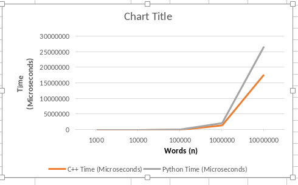

# Assignment 3 - Thomas Robillard
## Explanation
The algorithm chosen for this assignment is the Lempel-Ziv-Welch data
compression algorithm. I was skimming through Robert Sedgewick's book
on Algorithms, where it was described as working well for a variety of
different file types. Using a C++ implementation from [geeks4geeks](https://www.geeksforgeeks.org/computer-networks/lzw-lempel-ziv-welch-compression-technique/),
, and a Python version modified by ChatGPT, the two functions were tested
against a file, namely the contents of Moby Dick (book resource for Algorithms
by Robert Sedgewick), duplicated 64 times for
sufficient length, with a cmdline arg of the number of words, which are selected
from the file at random.

The chart below ranges from 1000 words to 10 million words. The C++ version
performed better as expected, which is shown better on the larger values for n
words. 

The processor used for this experiment was an Intel® Core™ i5-4670 CPU @ 3.40GHz × 4

